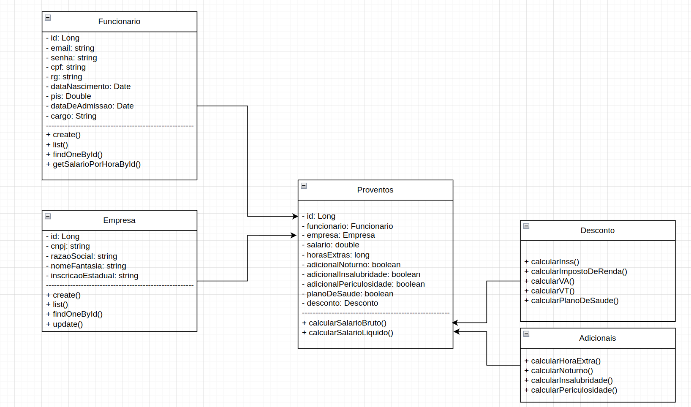

# 💰 PagueAqui – Sistema de Folha de Pagamento  

O **PagueAqui** é um sistema de gestão de **folha de pagamento** desenvolvido para auxiliar empresas no **cálculo de salários, benefícios, encargos e descontos**, garantindo **transparência** com os colaboradores e **conformidade** com as obrigações trabalhistas e fiscais.  

---

## 📑 Sumário
- [📖 Sobre o Projeto](#-sobre-o-projeto)  
- [🚀 Funcionalidades Principais](#-funcionalidades-principais)  
- [📌 Requisitos Não Funcionais](#-requisitos-não-funcionais)  
- [🛠️ Tecnologias Utilizadas](#️-tecnologias-utilizadas)  
- [📦 Entregas – Sprints](#-entregas--sprints)  

---

## 📖 Sobre o Projeto  
A folha de pagamento é um documento essencial que detalha todos os valores pagos e descontados dos funcionários em um período específico.  
Pensando nisso, o **PagueAqui** foi criado para **automatizar esse processo** e **facilitar o trabalho do setor de RH**.  

---

## 🚀 Funcionalidades Principais  
- 🔐 Autenticação com login e senha (acesso restrito a usuários autorizados)  
- ⏱️ Cálculo de jornada de trabalho  
- ➕ Cálculo de adicionais  
- 🎁 Cálculo de benefícios  
- ➖ Cálculo de descontos  
- 💵 Cálculo de salário líquido  
- 📊 Geração de relatórios completos da folha de pagamento  
- 🗄️ Armazenamento seguro dos dados por até **5 anos**  

---

## 📌 Requisitos Não Funcionais  
- **Usabilidade** → Interface simples e intuitiva  
- **Manutenibilidade** → Arquitetura organizada e de fácil evolução  

---

## 🛠️ Tecnologias Utilizadas  
- **Frontend:** React com TypeScript⚛️  
- **Backend:** Java com Spring Boot ☕  
- **Banco de Dados:** PostgreSQL 🗃️  
- **Gerenciamento de Dependências:** Maven  
- **Documentação de API:** Swagger (SpringDoc OpenAPI)  
- **Containerização:** Docker e Docker Compose  

---

## 📦 Entregas – Sprints

- 🎨 [Figma](https://www.figma.com/design/vlSw482Gcr3kPkM5rQNaC6/PagueAqui?node-id=1-4&p=f&t=mjGwYE3Rx7nn2pj3-0)  
- 📝 [Cartões CRC](./docs/cartoes-crc.pdf)  
- ✅ [Plano de Testes](./docs/plano-de-testes.pdf)  
- 📐 [UML (arquivo)](./docs/UML.png)
  

# API HR-Payroll (PagueAqui)

Documentação da API de backend para o sistema de cálculo de folha de pagamento PagueAqui.

## 1. Instruções de Build e Execução

Este projeto é uma API Spring Boot 3 com Java 21 e Maven. Ele depende de um banco de dados PostgreSQL.

### Pré-requisitos

* Java 21 (JDK)
* Apache Maven
* Docker e Docker Compose (para o banco de dados)

### 1.1. Configuração do Banco de Dados (PostgreSQL)

A forma mais simples de subir o banco de dados é usando o `docker-compose.yml` fornecido na raiz do projeto.

1.  Abra um terminal na raiz do projeto (onde o arquivo `docker-compose.yml` está).
2.  Execute o seguinte comando para iniciar o contêiner do PostgreSQL em segundo plano:

    ```bash
    docker-compose up -d
    ```

    Isso iniciará um banco de dados PostgreSQL na porta `5433`, com o usuário `postgres` e senha `postgres`, conforme configurado no `application.properties`.

### 1.2. Buildando a Aplicação (Maven)

Navegue até o diretório da API (`hrpayroll`) e execute o comando Maven para compilar o projeto e gerar o arquivo `.jar`.

```bash
Dentro da pasta /hrpayroll
mvn clean install
```
## 🚀 1.3. Executando a API
  
Após o build ser concluído com sucesso, você pode executar a aplicação de duas formas:
  
#### ✅ Opção 1: Usando java -jar
```bash
java -jar target/hrpayroll-0.0.1-SNAPSHOT.jar
```

#### ⚙️ Opção 2: Usando o plugin do Spring Boot
```bash
# Dentro da pasta /hrpayroll
mvn spring-boot:run
```

A API estará disponível em:  
👉 *http://localhost:8080*

---

## 📘 2. Documentação Interativa (Swagger)

A API utiliza **SpringDoc (Swagger)** para gerar automaticamente uma documentação interativa.

Após iniciar a aplicação, acesse:  
🔗 **http://localhost:8080/swagger-ui.html**

Nesta interface, você pode:
- Visualizar todos os endpoints
- Conferir os modelos de requisição e resposta
- Testar endpoints diretamente pelo navegador

---

## 🔑 3. Principais Endpoints e Exemplos

> **Nota sobre Autenticação:**  
> Endpoints que **não** estão listados como “Público” exigem um **Token JWT** no cabeçalho da requisição.  
> Esse token é obtido via `POST /auth/login`.

**Cabeçalho de Autorização:**
```
Authorization: Bearer <seu-token-jwt>
```

---

### 🔐 3.1. Autenticação (`/auth`)

Endpoints públicos para registro, login e recuperação de conta.

#### **POST /auth/login**
Realiza o login de um usuário (**HR**, **EMPLOYEE** ou **ADMIN**) e retorna um token JWT.

**Requisição (Body):**
```json
{
  "email": "admin@pagueaqui.com",
  "password": "SenhaSegura123",
  "accountType": "ADMIN"
}
```

**Resposta Esperada (200 OK):**
```json
{
  "accessToken": "eyJhbGciOiJIUzI1NiJ9.eyJzdWIiOiJhZG1pbkBwYWd1ZWFxdWkuY29tIiwiaWF0IjoxNzE1MTk3MzkxLCJleHAiOjE3MTUyODM3OTF9.uA...token...3s",
  "user": {
    "id": 1,
    "name": "Admin User",
    "email": "admin@pagueaqui.com",
    "role": "ADMIN"
  }
}
```

---

### 👷‍♀️ 3.2. Funcionários (`/funcionario`)

Endpoints para gerenciamento de funcionários. *(Requer Autenticação)*

#### **POST /funcionario/create**
Cadastra um novo funcionário no sistema.

**Requisição (Body):**
```json
{
  "nome": "Ana",
  "sobrenome": "Souza",
  "cpf": "11122233344",
  "rg": "12345678",
  "email": "ana.souza@empresa.com",
  "endereco": "Rua das Flores, 100",
  "dataNascimento": "1995-05-20",
  "dataDeAdmissao": "2023-01-10",
  "pis": 12345678901.0,
  "senha": "SenhaForte@123",
  "cargo": {
    "id": 1
  },
  "proventos": {
    "salarioBruto": 3500.00,
    "adicionalNoturno": false,
    "insalubridade": false,
    "periculosidade": false
  }
}
```

**Resposta Esperada:** `200 OK` *(Corpo vazio)*

---

#### **GET /funcionario/list**
Lista todos os funcionários cadastrados.

**Resposta (200 OK):**
```json
[
  {
    "id": 1,
    "nome": "Ana",
    "sobrenome": "Souza",
    "cpf": "11122233344",
    "email": "ana.souza@empresa.com",
    "endereco": "Rua das Flores, 100",
    "dataNascimento": "1995-05-20",
    "pis": 12345678901.0,
    "dataDeAdmissao": "2023-01-10",
    "cargo": {
      "id": 1,
      "nome": "Analista Jr",
      "descricao": "Analista de Sistemas Junior"
    },
    "proventos": {
      "id": 1,
      "salarioBruto": 3500.00,
      "adicionalNoturno": false,
      "insalubridade": false,
      "periculosidade": false
    }
  }
]
```

---

### 💰 3.3. Folha de Pagamento (`/folhas`)

Endpoints para geração e consulta de folhas de pagamento. *(Requer Autenticação)*

#### **POST /folhas/gerar/{companyId}**
Gera uma nova folha de pagamento para uma empresa.

**Exemplo de chamada:**
```
POST http://localhost:8080/folhas/gerar/1?dataInicio=2024-11-01&dataFim=2024-11-30&salarioBase=150000.00
```

**Resposta (201 CREATED):**
```json
{
  "id": 1,
  "dataInicio": "2024-11-01",
  "dataFim": "2024-11-30",
  "salarioBaseTotal": 150000.00,
  "totalDescontos": 25000.00,
  "totalProventos": 150000.00,
  "salarioLiquidoTotal": 125000.00,
  "companyId": 1
}
```

---

#### **GET /folhas/empresa/{companyId}**
Busca todas as folhas de pagamento geradas para uma empresa específica.

**Resposta (200 OK):**
```json
[
  {
    "id": 1,
    "dataInicio": "2024-11-01",
    "dataFim": "2024-11-30",
    "salarioBaseTotal": 150000.00,
    "totalDescontos": 25000.00,
    "totalProventos": 150000.00,
    "salarioLiquidoTotal": 125000.00,
    "companyId": 1
  }
]
```

---

## 🧩 4. Estrutura dos Arquivos Principais

| Arquivo | Função |

|----------|--------|

| *pom.xml* | Configura dependências do Maven (Spring Boot, PostgreSQL, JWT, Swagger) |

| *application.properties* | Define propriedades da aplicação e do banco de dados |

| *docker-compose.yml* | Provisiona o banco PostgreSQL com variáveis de ambiente |

| *Controllers/* | Contém os endpoints principais da API (AuthController, FuncionarioController, FolhaController) |

---

## 🧪 5. Testes

Os testes unitários e de integração garantem o funcionamento das regras de negócio e dos endpoints principais.

Para rodar os testes automatizados:

```bash
mvn test
````
---

## 🧠 6. Observações

- O sistema segue arquitetura *RESTful*.
- As respostas seguem o padrão *JSON UTF-8*.
- JWT é utilizado para autenticação e autorização.
- O Swagger é habilitado apenas em ambientes de desenvolvimento.

---

## 📘 Cálculo da Folha de Pagamento — Aplicação do Padrão Decorator

## 📌 Padrão Utilizado  
**Decorator**

---

## 📌 Justificativa da Escolha  

O método `salarioLiquidoById` da classe `FuncionarioService` concentrava diversas regras de negócio responsáveis pelo cálculo do salário líquido (INSS, IRRF, adicionais, descontos, etc.).  

Essa concentração de responsabilidades dificultava:

- a manutenção das regras de cálculo,  
- a escalabilidade do código,  
- a testabilidade das regras de negócio.

Para iniciar a modularização sem alterar a arquitetura geral da aplicação, aplicamos o **padrão Decorator** de forma minimalista apenas sobre o cálculo do **INSS**.  

Foi criada a interface `ICalculoSalarioComponente`, permitindo que **cada desconto ou adicional possa futuramente ser encapsulado como um componente decorável**.

O Decorator foi aplicado exclusivamente ao INSS como prova de conceito, sem impactar o funcionamento restante do backend ou frontend.

---
## 📌 Classes Criadas / Modificadas  

### ✅ Criada
- `ICalculoSalarioComponente.java`  
  Interface que define o contrato para componentes de cálculo salarial.

### ✏️ Modificada
- `FuncionarioService.java`  
  - Adicionada classe interna `CalculoBase`
  - Adicionado decorator aplicado ao cálculo do INSS  
  - Demais regras mantidas **inalteradas**

---

## 📌 Diagrama UML Simplificado do Decorator no Contexto


---

## 📌 Trechos de Código Demonstrando a Aplicação do Padrão

### **Interface criada — `ICalculoSalarioComponente.java`**

```
package com.example.hrpayroll.calculo;

public interface ICalculoSalarioComponente {
    Double calcular(Double salarioAtual, Double salarioBase);
}
```
### Componente base do Decorator
```
private class CalculoBase implements ICalculoSalarioComponente {
    @Override
    public Double calcular(Double salarioAtual, Double salarioBase) {
        return salarioAtual; // não altera nada
    }
```

### Aplicação do Decorator no cálculo do INSS
```
ICalculoSalarioComponente calculoINSS =
        new ICalculoSalarioComponente() {

            private ICalculoSalarioComponente componente = new CalculoBase();

            @Override
            public Double calcular(Double salarioAtual, Double salarioBase) {
                Double desconto = descontoService.calcularINSS(salarioBase);
                return componente.calcular(salarioAtual, salarioBase) - desconto;
            }
        };

// aplica o decorator ao cálculo
salarioLiquido = calculoINSS.calcular(salarioLiquido, salarioBruto);
```
---

✨ Projeto desenvolvido com foco em **automação, confiabilidade e escalabilidade**.  
